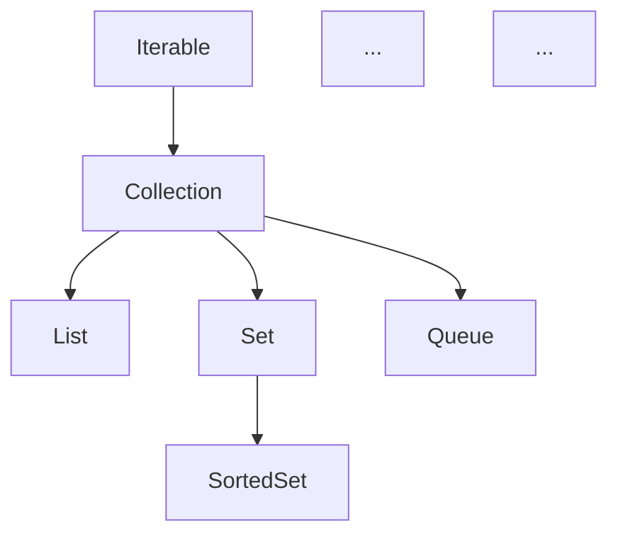

# Notes About Java

Talking with the Copilot and recording useful answers here.

## What is Java Stream?

A **Java Stream** (`java.util.stream.Stream`), introduced in Java 8, is a sequence of elements supporting sequential and parallel aggregate operations.

It allows you to process collections of objects in a **declarative**, **functional**, and **pipeline-driven** way (similar to SQL queries or Unix pipes).

---

### Key Characteristics of Streams

1. **Not a Data Structure:** A Stream does not store elements. It carries values from a source (like a `List`, `Set`, `Array`, or I/O channel) through a pipeline of computational steps.
2. **Lazy Evaluation:** Intermediate operations (like `filter` or `map`) are not executed until a terminal operation (like `collect` or `forEach`) is invoked.
3. **Consumable (Single-Use):** A Stream can only be traversed once. Once a terminal operation is called, the stream is closed/consumed.
4. **Functional & Immutable:** Operations produce a new result without modifying the original data source.

---

### Stream Pipeline Architecture

A Stream operation pipeline consists of 3 main parts:

```none
[ Source ] ---> [ Intermediate Operations ] ---> [ Terminal Operation ]
 (List, Set)       (filter, map, sorted)           (collect, forEach, count)
```

1. **Source:** Creating the stream (e.g., `list.stream()`).
2. **Intermediate Operations:** Transform or filter elements. Returns a new `Stream` (chainable).
   * `filter(Predicate)`
   * `map(Function)`
   * `sorted()`
   * `distinct()`
   * `limit(long)`
3. **Terminal Operations:** Trigger the processing and produce a result or side-effect.
   * `collect(Collectors.toList())`
   * `forEach(Consumer)`
   * `reduce()`
   * `count()`
   * `anyMatch(Predicate)`

---

### Practical Comparison: Traditional Loop vs Stream

#### Requirement: Filter names starting with "A", convert to uppercase, and collect into a list

#### Traditional Imperative Approach

```java
List<String> names = List.of("Anna", "Bob", "Alexander", "Charlie");
List<String> result = new ArrayList<>();

for (String name : names) {
    if (name.startsWith("A")) {
        result.add(name.toUpperCase());
    }
}
```

#### Declarative Stream Approach

```java
List<String> names = List.of("Anna", "Bob", "Alexander", "Charlie");

List<String> result = names.stream()
                           .filter(name -> name.startsWith("A"))
                           .map(String::toUpperCase)
                           .collect(Collectors.toList());
// Output: ["ANNA", "ALEXANDER"]
```

---

### Connection between `Optional` and `Stream`

In Java 9+, `Optional` added a `.stream()` method. An `Optional` can be thought of as a stream with **0 or 1 element**:

```java
List<Optional<String>> optionals = List.of(
    Optional.of("Alice"),
    Optional.empty(),
    Optional.of("Bob")
);

// Extract only present values into a single List<String>
List<String> presentValues = optionals.stream()
                                      .flatMap(Optional::stream)
                                      .collect(Collectors.toList());
// Result: ["Alice", "Bob"]
```

## What is a Collector?

A **`Collector`** (`java.util.stream.Collector<T, A, R>`) in Java is a key component of the Stream API that defines how elements of a stream should be **accumulated, transformed, and combined** into a final result during a terminal `collect()` operation.

While `.collect(...)` is the terminal method on a `Stream`, the `Collector` passed to it provides the recipe/logic for how to perform that reduction.

---

### Key Responsibilities of a Collector

1. **Creation (`Supplier`):** Creates the mutable result container (e.g., a new `ArrayList` or `HashSet`).
2. **Accumulation (`BiConsumer`):** Adds each stream element to the container.
3. **Combining (`BinaryOperator`):** Merges two partial containers when running in parallel streams.
4. **Finishing (`Function`, optional):** Performs a final transformation on the container (e.g., converting a `List` to an unmodifiable list).

---

### Common Built-in Collectors (`java.util.stream.Collectors`)

Most of the time, you don't implement `Collector` from scratch; you use predefined factory methods in the `Collectors` utility class:

#### 1. Accumulating into Collections

* **`toList()` / `toUnmodifiableList()`**:

  ```java
  List<String> list = stream.collect(Collectors.toList());
  ```

  In order to collect the stream to a concrete implementation of a list, you can use `Collectors.toCollection` method with the constructor reference:

  ```java
  List<String> list = stream.collect(Collectors.toCollection(ArrayList::new));
  ```

* **`toSet()`**:

  ```java
  Set<String> set = stream.collect(Collectors.toSet());
  ```

* **`toMap(keyMapper, valueMapper)`**:

  ```java
  Map<Integer, String> map = users.stream()
                                  .collect(Collectors.toMap(User::getId, User::getName));
  ```

#### 2. Joining Strings

* **`joining(delimiter)`**:

  ```java
  String result = List.of("Java", "Stream", "API")
                      .stream()
                      .collect(Collectors.joining(", ")); 
  // Result: "Java, Stream, API"
  ```

The same effect can also be achieved directly with `String.join` method:

```Java
String result = String.join(", ", words)
```

#### 3. Summarizing & Averaging

* **`counting()`**: Counts elements.
* **`averagingInt()` / `summingInt()`**: Computes averages or totals.

  ```java
  double avgAge = users.stream()
                       .collect(Collectors.averagingInt(User::getAge));
  ```

#### 4. Grouping & Partitioning

* **`groupingBy(...)`**: Categorizes elements based on a function (similar to SQL `GROUP BY`).

  ```java
  Map<Department, List<Employee>> byDept = employees.stream()
      .collect(Collectors.groupingBy(Employee::getDepartment));
  ```

* **`partitioningBy(...)`**: Splits elements into two groups based on a `boolean` predicate (`true`/`false`).

  ```java
  Map<Boolean, List<Student>> passedOrFailed = students.stream()
      .collect(Collectors.partitioningBy(s -> s.getGrade() >= 60));
  ```

---

### Summary Analogy

If a **Stream** is a factory conveyor belt bringing items one by one, a **`Collector`** is the worker at the end of the line with a container (a box, a map, or a summary sheet) deciding how to assemble or package those items into the final product.

## What is a Java Collection?

A **Java Collection** is a framework architecture (`java.util`) that provides a unified data structure representation for grouping and manipulating a group of objects as a single unit.

---

### 1. The Core Collection Hierarchy

The Java Collections Framework revolves around core interfaces:



> **Note:** `Map` is part of the Java Collections Framework, but it **does not extend** the `Collection` interface because it stores key-value pairs rather than single elements.

---

### 2. Primary Collection Types & Implementations

| Interface | Key Trait | Common Implementations | Example Use Case |
| :--- | :--- | :--- | :--- |
| **`List`** | Ordered, allows duplicates, indexed access. | `ArrayList`, `LinkedList` | Maintaining a dynamic list of items in order. |
| **`Set`** | Unordered (usually), **no duplicates**. | `HashSet`, `TreeSet` (sorted), `LinkedHashSet` | Storing unique values like user IDs or tags. |
| **`Queue`** | Holds elements prior to processing (FIFO / Priority). | `LinkedList`, `PriorityQueue`, `ArrayDeque` | Task processing queues or messaging buffers. |
| **`Map`** | Stores **Key-Value pairs**, keys are unique. | `HashMap`, `TreeMap` (sorted keys), `LinkedHashMap` | Looking up values by a unique identifier or dictionary. |

---

### 3. Collection vs Collection Utility vs Collections Framework

* **`Collection` (Interface):** The root interface for lists, sets, and queues (`java.util.Collection`).
* **`Collections` (Utility Class):** A helper class (`java.util.Collections`) filled with static methods for operations like sorting, shuffling, reversing, or wrapping unmodifiable collections (e.g., `Collections.sort(list)`, `Collections.unmodifiableList(list)`).
* **`Collections Framework`:** The overall architecture of interfaces, implementations, and algorithms in `java.util`.

---

### 4. Collections vs Java Streams

| Aspect | Collection | Java Stream |
| :--- | :--- | :--- |
| **Purpose** | Storing and managing data in memory. | Computing and processing data. |
| **Modification** | You add, remove, or modify elements directly. | Elements cannot be added or removed from the stream. |
| **Iteration** | External iteration (explicit `for` loops or iterators). | Internal iteration (managed by the stream pipeline). |
| **Reuse** | Can be iterated over and reused repeatedly. | Consumed once; a new stream must be created to re-process. |

## What is an Optional?

An `Optional` (`java.util.Optional<T>`) is a single-value container object introduced in Java 8 that may or may not contain a non-null value. It is designed to represent the presence or absence of a value explicitly, helping to prevent `NullPointerException` without requiring explicit `null` checks throughout your code.

---

### Methods Available in `java.util.Optional`

#### 1. Creating Instances

* `Optional.of(T value)` – Wraps a non-null value. Throws `NullPointerException` if the value is `null`.
* `Optional.ofNullable(T value)` – Wraps a value if non-null, or returns an empty `Optional` if `null`.
* `Optional.empty()` – Returns an empty `Optional` instance.

#### 2. Checking State

* `isPresent()` – Returns `true` if a value is present, `false` otherwise.
* `isEmpty()` – Returns `true` if the `Optional` is empty (Java 11+).

#### 3. Retrieving Values

* `get()` – Returns the value if present; throws `NoSuchElementException` if empty.
* `orElse(T other)` – Returns the value if present, otherwise returns `other`.
* `orElseGet(Supplier<? extends T> supplier)` – Returns the value if present, otherwise calls `supplier` to get a default.
* `orElseThrow()` – Returns the value if present; throws `NoSuchElementException` if empty (Java 10+).
* `orElseThrow(Supplier<? extends X> exceptionSupplier)` – Returns the value if present; throws an exception provided by the supplier if empty.

#### 4. Conditional Actions

* `ifPresent(Consumer<? super T> action)` – Executes `action` with the value if present.
* `ifPresentOrElse(Consumer<? super T> action, Runnable emptyAction)` – Executes `action` if present, otherwise executes `emptyAction` (Java 9+).

#### 5. Transforming & Filtering

* `filter(Predicate<? super T> predicate)` – Keeps the value if it matches the predicate, otherwise returns an empty `Optional`.
* `map(Function<? super T, ? extends U> mapper)` – Applies the mapping function to the value if present and returns an `Optional` of the result.
* `flatMap(Function<? super T, ? extends Optional<? extends U>> mapper)` – Similar to `map`, but expects the mapper function to return an `Optional`.
* `or(Supplier<? extends Optional<? extends T>> supplier)` – Returns this `Optional` if present, otherwise returns the `Optional` produced by `supplier` (Java 9+).
* `stream()` – Converts the `Optional` into a `Stream` containing zero or one element (Java 9+).

## Practical Examples with Optionals

Here are common practical patterns for using `Optional` in Java.

---

### 1. Safely Providing Default Values (`orElse` vs `orElseGet`)

Instead of writing explicit `null` checks:

```java
// Traditional null check
String name = (user != null && user.getName() != null) ? user.getName() : "Guest";

// Optional approach
String name = Optional.ofNullable(user)
                      .map(User::getName)
                      .orElse("Guest");
```

> **Tip:** Use `orElseGet(() -> computeDefault())` when calculating the default value is expensive, as it will only execute if the `Optional` is empty.

---

### 2. Transforming Values Safely (`map` & `flatMap`)

Chain transformations without worrying about `NullPointerException`:

```java
// Safely extract nested properties
Optional<String> city = Optional.ofNullable(user)
                                .map(User::getAddress)
                                .map(Address::getCity);
```

If a method already returns an `Optional`, use `flatMap`:

```java
public class User {
    public Optional<Address> getAddress() {
        return Optional.ofNullable(address);
    }
}

// Avoid Optional<Optional<Address>> using flatMap
Optional<String> city = Optional.ofNullable(user)
                                .flatMap(User::getAddress)
                                .map(Address::getCity);
```

---

### 3. Filtering Values (`filter`)

Check condition on the value inside `Optional`:

```java
// Process user only if email is verified
Optional.ofNullable(user)
        .filter(User::isEmailVerified)
        .ifPresent(u -> sendNotification(u));
```

---

### 4. Throwing Custom Exceptions (`orElseThrow`)

Cleanly validate presence and throw meaningful domain exceptions:

```java
User user = userRepository.findById(userId)
                          .orElseThrow(() -> new UserNotFoundException("User not found with id: " + userId));
```

---

### 5. Performing Side Effects (`ifPresent` & `ifPresentOrElse`)

Execute code only when a value exists:

```java
// Print only if present
Optional.ofNullable(user)
        .ifPresent(u -> System.out.println("Hello, " + u.getName()));

// Execute fallback action if empty (Java 9+)
Optional.ofNullable(user)
        .ifPresentOrElse(
            u -> System.out.println("User found: " + u.getName()),
            () -> System.out.println("No user found")
        );
```

---

### 6. Refactoring your `StringUtils.java` method

In `StringUtils.java:5-8`, you can simplify `isEmpty`:

```java
// Current code in StringUtils.java:
// public static boolean isEmpty(String str) {
//     Optional<String> optionalStr = Optional.ofNullable(str);
//     return optionalStr.isEmpty() || optionalStr.get().isEmpty();
// }

// Idiomatic Optional approach:
public static boolean isEmpty(String str) {
    return Optional.ofNullable(str)
                   .map(String::trim)
                   .filter(s -> !s.isEmpty())
                   .isEmpty();
}
```

---

### ⚠️ Best Practices / What to Avoid

1. **Don't call `.get()` without checking `.isPresent()` first** — calling `.get()` on an empty `Optional` throws `NoSuchElementException`.
2. **Don't use `Optional` for field members or method parameters** — it is meant primarily as a **return type** to indicate potential absence of a value.
3. **Don't use `Optional` with collections** — return an empty list/set (`Collections.emptyList()`) instead of `Optional<List<T>>`.

## What is a Supplier and Consumer?

Both **`Supplier<T>`** and **`Consumer<T>`** are core **functional interfaces** in Java (`java.util.function`), introduced in Java 8 to support functional programming and lambda expressions.

They are exact opposites of each other in terms of data flow:

* **`Supplier`** **produces** data (takes nothing, returns something).
* **`Consumer`** **consumes** data (takes something, returns nothing).

---

### Comparison at a Glance

| Aspect | `Supplier<T>` | `Consumer<T>` |
| :--- | :--- | :--- |
| **Role** | Data Producer / Factory | Data Consumer / Action Executor |
| **Method** | `T get()` | `void accept(T t)` |
| **Input Arguments** | `0` (None) | `1` argument of type `T` |
| **Return Value** | Value of type `T` | `void` (Nothing) |
| **Lambda Syntax** | `() -> value` | `(value) -> { /* do something */ }` |

---

### 1. `Supplier<T>` (The Factory / Producer)

Takes no input, returns a value of type `T`.

#### Definition Supplier

```java
@FunctionalInterface
public interface Supplier<T> {
    T get();
}
```

#### Examples Supplier

```java
// 1. Lambda producing a random number
Supplier<Double> randomSupplier = () -> Math.random();
Double val = randomSupplier.get();

// 2. Method reference acting as an object factory
Supplier<List<String>> listFactory = ArrayList::new;
List<String> list = listFactory.get();

// 3. Lazy evaluation in Optional
String result = optional.orElseGet(() -> "Default Fallback Value");
```

---

### 2. `Consumer<T>` (The Worker / Action)

Takes one input of type `T`, performs an operation (side-effect), and returns nothing (`void`).

#### Definition Consumer

```java
@FunctionalInterface
public interface Consumer<T> {
    void accept(T t);
}
```

#### Examples Consumer

```java
// 1. Lambda printing a string
Consumer<String> printer = message -> System.out.println("LOG: " + message);
printer.accept("Application started");

// 2. Used in Stream / Iterable forEach
List<String> names = List.of("Alice", "Bob", "Charlie");
names.forEach(name -> System.out.println(name)); // forEach takes a Consumer

// 3. Used in Optional.ifPresent
Optional<String> nameOpt = Optional.of("Alice");
nameOpt.ifPresent(name -> System.out.println("Hello " + name)); // ifPresent takes a Consumer
```

---

### Combining Supplier & Consumer

You can use both together to create clean pipelines where one component produces data and another consumes it:

```java
public static <T> void processData(Supplier<T> supplier, Consumer<T> consumer) {
    T data = supplier.get(); // 1. Produce data
    consumer.accept(data);   // 2. Consume data
}

public static void main(String[] args) {
    processData(
        () -> "Hello from Supplier!",              // Supplier<String>
        msg -> System.out.println("Consumer got: " + msg) // Consumer<String>
    );
}
```

## One-Line Lambda Expression and Return Value

### 1. Does a single-line lambda expression return a value?

**It depends on whether it has an expression body or a block body.**

#### A. Expression Body (Implicit Return)

If you write a single-line lambda **without curly braces `{}`**, it implicitly returns the result of that expression:

```java
// Implicitly returns str.toUpperCase() -> returns a String
Function<String, String> upper = str -> str.toUpperCase();

// Implicitly returns a + b -> returns an int
BiFunction<Integer, Integer, Integer> add = (a, b) -> a + b;
```

#### B. Block Body (Explicit Return Required)

If you use curly braces `{}` (even on one line), you **must** use an explicit `return` statement to return a value:

```java
// Requires explicit 'return' keyword because of { }
Function<String, String> upper = str -> { return str.toUpperCase(); };
```

---

### 2. What does `System.out.println` return?

`System.out.println()` has a return type of **`void`** (it returns **nothing**).

Because its return type is `void`:

* It **cannot** be used where a value-returning expression is expected (like in a `Supplier<T>` or `Function<T, R>`).
* It **can only** be used where `void` is expected (like in a `Consumer<T>` or `Runnable`).

---

### How this affects Lambda Compatibility

#### ❌ Invalid Example (Trying to return `System.out.println` in a `Supplier`)

```java
// Compilation Error: System.out.println() returns void, but Supplier expects a String!
Supplier<String> supplier = () -> System.out.println("Hello"); 
```

#### ✅ Valid Example (Using `System.out.println` in a `Consumer`)

```java
// Valid! Consumer expects void, and System.out.println() returns void.
Consumer<String> consumer = msg -> System.out.println(msg);
```

#### ✅ Valid Example (Using `System.out.println` inside a multi-line lambda)

```java
Supplier<String> supplier = () -> {
    System.out.println("Side effect here"); // void statement
    return "Actual Return Value";          // Explicit return value for Supplier
};
```

## Java Casting

Casting is converting a variable from one data type to another. There are two kinds:

### 1. Widening Casting (implicit/automatic)

Converting a smaller type to a larger type. Done automatically — no data loss, no syntax needed.

`byte` → `short` → `char` → `int` → `long` → `float` → `double`

```java
int myInt = 9;
double myDouble = myInt;   // automatic: int → double
System.out.println(myDouble);  // 9.0
```

### 2. Narrowing Casting (explicit/manual)

Converting a larger type to a smaller type. Must be done manually by placing the type in parentheses — possible data loss.

```java
double myDouble = 9.78;
int myInt = (int) myDouble;   // manual: double → int
System.out.println(myInt);    // 9  (fractional part is truncated)
```

### 3. Object Casting (reference types)

Casting between classes in an inheritance hierarchy:

* **Upcasting** (implicit): child → parent, always safe.

```java
Animal a = new Dog();   // upcast
```

* **Downcasting** (explicit): parent → child, can throw `ClassCastException` at runtime if the object isn't actually that type.

```java
Dog d = (Dog) a;   // downcast — valid only because a really is a Dog
```

Safe downcasting with `instanceof` (pattern matching since Java 16):

```java
if (a instanceof Dog d) {
    d.bark();   // no explicit cast needed
}
```

### Key points

* Casting never changes the object itself, only how it's viewed.
* Narrowing primitives truncates/overflows; narrowing objects risks `ClassCastException`.
* `String` is not a primitive — `(int) "123"` fails; use `Integer.parseInt("123")` instead.

## Try with Resources

Try-with-resources is a Java feature (since Java 7) that automatically closes resources — such as files, streams, or database connections — when the `try` block finishes, even if an exception occurs. It eliminates the need for explicit `finally` blocks just to call `close()`.

### Syntax

Any object declared in the parentheses after `try` must implement `AutoCloseable` (or `Closeable`):

```java
try (BufferedReader br = new BufferedReader(new FileReader("data.txt"))) {
    System.out.println(br.readLine());
} catch (IOException e) {
    e.printStackTrace();
}
// br.close() is called automatically here — no finally block needed
```

### Old style vs. new style

Without try-with-resources, you had to write verbose cleanup code:

```java
BufferedReader br = null;
try {
    br = new BufferedReader(new FileReader("data.txt"));
    System.out.println(br.readLine());
} catch (IOException e) {
    e.printStackTrace();
} finally {
    if (br != null) {
        try {
            br.close();   // close() itself can throw
        } catch (IOException e) {
            e.printStackTrace();
        }
    }
}
```

### Multiple resources

Separate them with semicolons — they are closed in reverse order of declaration:

```java
try (FileInputStream in = new FileInputStream("in.txt");
     FileOutputStream out = new FileOutputStream("out.txt")) {
    out.write(in.readAllBytes());
}
```

### Key points — Try with Resources

* The resource must implement `java.lang.AutoCloseable`.
* Since Java 9, you can use effectively-final variables declared outside the `try`: `try (br) { ... }`.
* If both the `try` body and `close()` throw exceptions, the `close()` exception is **suppressed** and attached to the main exception (retrievable via `getSuppressed()`).
* Resources are closed before any `catch` or `finally` block runs.

## Java Single vs Double Quotes

In Java, single and double quotes are **not interchangeable** — they denote fundamentally different types.

### Single quotes: `char` literals

Single quotes hold exactly **one character** and produce the primitive type `char`:

```java
char letter = 'A';
char digit = '7';
char symbol = '#';
char unicode = 'A';   // escape sequences work too
```

### Double quotes: `String` objects

Double quotes hold **zero or more characters** and produce a `String` object:

```java
String name = "Furkan";
String single = "A";   // still a String, NOT a char
String empty = "";     // valid — an empty String
```

### The difference matters

```java
char c = 'a' + 'b';        // 195 → chars are numbers (97 + 98)
String s = "a" + "b";      // "ab" → string concatenation
System.out.println('a' + 'b');   // 195
System.out.println("a" + "b");   // ab
```

Other consequences:

```java
// char c = 'AB';    // ❌ compile error: too many characters
// char c = "A";     // ❌ compile error: String cannot convert to char
String s = 'A';       // ❌ compile error: char cannot convert to String
```

### Key points — Single and Double Quotes

| | `'single'` | `"double"` |
| --- | --- | --- |
| Type | `char` (primitive) | `String` (object) |
| Length | exactly 1 character | any length, including 0 |
| `+` behavior | numeric addition | concatenation |
| Methods | none (primitive) | `.length()`, `.toUpperCase()`, etc. |

* To convert: `String.valueOf('A')` → `"A"`, and `"A".charAt(0)` → `'A'`.
* Java has no triple-quoted strings, but text blocks (`"""..."""`, Java 15+) use double quotes.

## Java Generics and Type Erasure

### What are Generics?

Generics allow classes, interfaces, and methods to operate on specified types as parameters, providing **compile-time type safety** without manual casting.

```java
List<String> list = new ArrayList<>();
list.add("hello");
String s = list.get(0); // type-safe, no cast needed
```

### Are Generics Removed at Runtime? (Type Erasure)

**Yes.** Java uses **Type Erasure** for backward compatibility:

1. **Compile-time checking:** Types are validated at compile time.
2. **Erasure:** The compiler removes generic type arguments and replaces them with their bound (or `Object`).
3. **Casts inserted:** Necessary explicit casts are added to bytecode automatically.

At runtime, `List<String>` and `List<Integer>` both become raw `List`.

### Why Type Erasure instead of Monomorphization (separate classes per type like C++)?

1. **Backward Compatibility:** Allowed existing Java 1.0–1.4 code to run on Java 5+ without breaking compiled binaries or JVM instructions.
2. **Avoiding Code Bloat:** Only one `.class` file (`ArrayList.class`) is generated and loaded in Metaspace.
3. **JVM Simplicity:** Enforced purely at compile time without major JVM changes.

---

## `TypeRef` / `TypeToken` and Runtime Type Erasure

### Does `TypeRef` solve Type Erasure?

**Partially.** `TypeRef` (or Jackson's `TypeReference` / Gson's `TypeToken`) does not change how the JVM erases generic instance types, but uses **subclass generic metadata retention** to capture type info at runtime.

### How it works

1. **Anonymous Subclass:** `new TypeRef<List<User>>() {}` creates an anonymous subclass of `TypeRef`.
2. **Metadata Retained:** The Java compiler writes generic superclass signatures (`<List<User>>`) into the child class's constant pool metadata.
3. **Reflection:** In the constructor, `getClass().getGenericSuperclass()` reads the retained `ParameterizedType` metadata.

---

## Anonymous Subclass Syntax

An **anonymous subclass** declares and instantiates an unnamed class in a single statement using `{}` right after the constructor:

```java
// Creates an anonymous subclass of TypeRef<List<String>> and instantiates it
TypeRef<List<String>> ref = new TypeRef<List<String>>() {
    // optional class body / overrides
};
```

### Key Differences: Anonymous Subclass vs. Array Initialization

While both use `{}` with `new`, they are completely separate syntax constructs:

| Feature | Anonymous Subclass Syntax | Array Initializer Syntax |
| --- | --- | --- |
| **Example** | `new Thread() { public void run() {} }` | `new int[] { 1, 2, 3 }` |
| **Inside `{}`** | Class body code (fields, methods) | Data elements/expressions |
| **Result** | Creates an unnamed subclass instance | Creates and populates an array |

## Java Reflection

**Java Reflection** is an API (`java.lang.reflect` package) that allows a running Java program to inspect, interrogate, and modify the internal structure and behavior of classes, interfaces, fields, methods, constructors, and annotations at **runtime**—even those that are `private`.

---

## 1. Important Reflection Classes You Need to Know

All reflection operations start from **`java.lang.Class<T>`**, which is the entry point to inspect any class at runtime.

| Class | Package | What It Represents / Does |
| --- | --- | --- |
| **`Class<T>`** | `java.lang` | Represents a class or interface at runtime. Used to query methods, fields, constructors, annotations, and superclasses. |
| **`Field`** | `java.lang.reflect` | Represents a member variable (field). Allows reading (`get()`) or setting (`set()`) values dynamically, even `private` fields via `setAccessible(true)`. |
| **`Method`** | `java.lang.reflect` | Represents a method. Allows invoking the method dynamically (`invoke(target, args)`). |
| **`Constructor<T>`** | `java.lang.reflect` | Represents a constructor. Used to instantiate objects dynamically (`newInstance(args)`). |
| **`Type`** | `java.lang.reflect` | The common superinterface for all types in Reflection (classes, parameterized generic types, arrays, type variables). |
| **`ParameterizedType`** | `java.lang.reflect` | Subinterface of `Type` representing generic types with actual type arguments (e.g., `List<String>`). Used to retrieve generic type parameters at runtime. |
| **`Annotation`** | `java.lang.annotation` | Represents an annotation attached to a class, method, field, or parameter. Checked via `isAnnotationPresent()` and `getAnnotation()`. |
| **`Modifier`** | `java.lang.reflect` | Utility class to decode access flags (`public`, `private`, `static`, `final`, etc.) on classes or members. |

---

## 2. What are `Field` and `Type`?

### `Field` Class

A `Field` object provides metadata about a single field of a class or interface and dynamic access to its value on a target instance:

```java
public class User {
    private String name = "Furkan";
}

// Reflection inspection & modification:
User user = new User();
Class<?> clazz = user.getClass();

Field nameField = clazz.getDeclaredField("name");
nameField.setAccessible(true); // bypass private access check

String value = (String) nameField.get(user); // "Furkan"
nameField.set(user, "NewName");             // Modifies private field value directly!
```

### `Type` Interface

`Type` is the top-level interface introduced in Java 5 to support the **generic type system**.

```none
                     Type (Interface)
                       |
     +-----------------+-----------------+
     |                                   |
Class<?> (raw type)             ParameterizedType (generics e.g. List<User>)
```

* `Class<?>` implements `Type` (representing non-generic or raw types like `String.class`).
* `ParameterizedType` represents generic types (e.g., `List<User>`). Calling `parameterizedType.getActualTypeArguments()` returns the actual generic parameters (`[User.class]`).

---

## 3. Do Spring Boot Annotations Work with Reflection?

**Yes, absolutely.** Reflection is the core underlying engine of the **Spring Framework** and **Spring Boot**.

### How Spring Uses Reflection with Annotations

1. **Component Scanning & Bean Creation (`@Component`, `@Service`, `@Repository`, `@Controller`):**
   Spring scans the classpath at startup, uses Reflection to find classes annotated with `@Component`, inspects their `Constructor`s, and instantiates them via `Constructor.newInstance()`.

2. **Dependency Injection (`@Autowired`, `@Value`):**
   Spring inspects fields marked with `@Autowired`. Using Reflection (`field.setAccessible(true)` and `field.set(bean, dependency)`), Spring injects dependencies into `private` fields without needing getters or setters.

3. **Request Mapping & Routing (`@GetMapping`, `@PostMapping`):**
   Spring Web scans controller classes for methods annotated with `@GetMapping("/path")`. When an HTTP request comes in, Spring finds the corresponding `Method` object and executes it via `method.invoke(controllerBean, args)`.

4. **Aspect-Oriented Programming & Proxies (`@Transactional`):**
   Spring creates dynamic JDK proxies (`java.lang.reflect.Proxy`) or CGLIB proxies around beans to intercept method invocations using Reflection, enabling features like declarative transaction management.

---

## Summary of Reflection Uses & Trade-offs

| Pros | Cons |
| --- | --- |
| Enables frameworks (Spring, JUnit, Jackson, Hibernate). | **Performance Overhead:** Bypasses JVM optimizations (JIT inline). |
| Enables dynamic behavior and runtime plugin architectures. | **Security/Encapsulation Risk:** Can break `private` encapsulation. |
| Inspects metadata & annotations without hardcoded types. | **Compile-time Safety Lost:** Errors shift from compile-time to runtime (`NoSuchFieldException`). |

## Static and Default Methods in Java Interfaces

Before Java 8, interfaces could **only** contain abstract methods (no method bodies) and public static final constants. Java 8 introduced **default** and **static** methods inside interfaces.

---

### 1. Default Methods (`default`)

A `default` method provides a **default implementation** inside an interface. Classes implementing the interface inherit this implementation automatically but can choose to override it.

```java
public interface Vehicle {
    void drive(); // abstract method

    // Default method
    default void startEngine() {
        System.out.println("Engine started...");
    }
}
```

#### Why were Default Methods introduced?

* **Backward Compatibility (Interface Evolution):** Allowed Java library maintainers (like the JDK team) to add new methods to existing interfaces (e.g., adding `.stream()` or `.forEach()` to `java.util.Collection`) **without breaking** millions of existing classes that implemented those interfaces.

---

### 2. Static Methods (`static`)

A `static` method belongs to the interface itself, not to any implementing object. It **cannot be overridden** by implementing classes and is invoked directly on the interface name.

```java
public interface Vehicle {
    static boolean isVehicle(Object obj) {
        return obj instanceof Vehicle;
    }
}

// Invocation
boolean result = Vehicle.isVehicle(myCar);
```

#### Why use Static Methods in Interfaces?

* **Utility Methods:** Keeps helper/factory methods closely tied to the interface instead of putting them into a separate helper class (e.g., `List.of(...)`, `Comparator.comparing(...)`).

---

## Why "Constant Interface" is an Anti-Pattern

The **Constant Interface Anti-Pattern** occurs when an interface is created *solely* to define constants, and classes implement that interface just to use those constants without qualifying them with the interface name:

```java
// ❌ ANTI-PATTERN: Constant Interface
public interface AppConstants {
    double PI = 3.14159;
    int MAX_USERS = 100;
}

public class UserService implements AppConstants {
    public void process() {
        if (userCount > MAX_USERS) { ... } // uses MAX_USERS directly
    }
}
```

### Why is this bad?

1. **Pollutes Class API:** Implementing an interface makes its constants part of the class’s **public API contract**. Any subclass or consumer of `UserService` will see `MAX_USERS` and `PI` as members of `UserService`.
2. **Leaks Implementation Details:** How a class calculates a value is an internal detail. Implementing an interface exposes those constants externally forever.
3. **Binary Incompatibility:** If future code removes or renames constants in the interface, it breaks all implementing classes.
4. **Misuses Inheritance:** Interfaces are meant to define **types and behaviors** ("is-a" or "can-do"), not to share static data.

---

## The Better Alternative: Utility Class with Private Constructor

Instead of a constant interface, define a `final` class with a `private` constructor holding `public static final` variables:

```java
// ✅ RECOMMENDED: Utility class with private constructor
public final class AppConstants {

    // Private constructor prevents instantiation
    private AppConstants() {
        throw new UnsupportedOperationException("Utility class cannot be instantiated");
    }

    public static final double PI = 3.14159;
    public static final int MAX_USERS = 100;
}
```

### Why this approach is superior

* **Cannot be instantiated:** The `private` constructor prevents `new AppConstants()`.

* **Cannot be subclassed:** `final` prevents inheritance.
* **Does not leak into APIs:** Classes use constants explicitly via `AppConstants.MAX_USERS` or via `import static`:

```java
import static com.example.AppConstants.MAX_USERS;

public class UserService {
    public void process() {
        if (userCount > MAX_USERS) { ... }
    }
}
```

---

## Summary Comparison

| Strategy | Recommended? | Key Characteristics |
| --- | --- | --- |
| **Constant Interface** | ❌ **Anti-Pattern** | Pollutes implementing classes' public APIs; misuses interfaces. |
| **`final` Utility Class** | ✅ **Best Practice** | Private constructor prevents `new`; constants accessed via class name or static import. |
| **`enum`** | ✅ **Best Practice** | Ideal when constants represent a fixed, type-safe set of related domain values (e.g., `HttpStatus`, `DayOfWeek`). |

## Java Enums

An **`enum`** (short for *enumeration*) is a special class in Java introduced in Java 5 that represents a **group of unchangeable, fixed constants** (like days of the week, compass directions, or HTTP status codes).

---

### 1. Basic Enum Syntax

By default, enum constants are `public static final`:

```java
public enum Day {
    MONDAY, TUESDAY, WEDNESDAY, THURSDAY, FRIDAY, SATURDAY, SUNDAY
}
```

Usage:

```java
Day today = Day.MONDAY;

if (today == Day.FRIDAY) {
    System.out.println("Weekend is near!");
}
```

---

### 2. Key Features of Java Enums

In Java, enums are much more powerful than simple integer constants in C or C++. In Java, an **enum is a full-fledged class**:

* **Type-Safe:** You cannot assign any value outside the declared enum constants (prevents invalid state bugs).
* **Can have Fields, Constructors, and Methods:** Enums can carry state and custom logic.
* **Inherits from `java.lang.Enum`:** Automatically gets built-in methods like `.name()`, `.ordinal()`, and `.compareTo()`.
* **Cannot be Instantiated directly:** The constructor is implicitly `private`.
* **Cannot Extend other classes:** Since all enums implicitly extend `java.lang.Enum` (Java does not support multiple class inheritance).
* **Can Implement Interfaces:** Enums can implement one or more interfaces.

---

### 3. Enum with Fields, Constructors, and Methods

You can attach properties and methods to each enum constant:

```java
public enum HttpStatus {
    OK(200, "OK"),
    NOT_FOUND(404, "Not Found"),
    INTERNAL_SERVER_ERROR(500, "Internal Server Error");

    private final int code;
    private final String message;

    // Constructor MUST be private (or package-private)
    HttpStatus(int code, String message) {
        this.code = code;
        this.message = message;
    }

    public int getCode() {
        return code;
    }

    public String getMessage() {
        return message;
    }

    public boolean isError() {
        return code >= 400;
    }
}
```

Usage:

```java
HttpStatus status = HttpStatus.NOT_FOUND;

System.out.println(status.getCode());    // 404
System.out.println(status.getMessage()); // "Not Found"
System.out.println(status.isError());    // true
```

---

### 4. Built-in Utility Methods

Every Java enum automatically comes with useful methods:

```java
// 1. values() - Returns an array of all enum constants in order
for (Day d : Day.values()) {
    System.out.println(d);
}

// 2. valueOf(String) - Converts String to Enum constant (throws IllegalArgumentException if invalid)
Day d = Day.valueOf("MONDAY");

// 3. name() - Returns exact name as declared
String name = Day.MONDAY.name(); // "MONDAY"

// 4. ordinal() - Returns 0-based declaration index (use cautiously)
int index = Day.MONDAY.ordinal(); // 0
```

---

### 5. `EnumSet` and `EnumMap`

Java provides highly optimized collection classes tailored specifically for enums:

* **`EnumSet`:** Bit-vector-based `Set` implementation for enums. Extremely fast and memory efficient.

  ```java
  Set<Day> weekend = EnumSet.of(Day.SATURDAY, Day.SUNDAY);
  ```

* **`EnumMap`:** Array-based `Map` implementation where keys are enum constants. Much faster than a standard `HashMap`.

  ```java
  Map<HttpStatus, String> responses = new EnumMap<>(HttpStatus.class);
  responses.put(HttpStatus.OK, "Success body");
  ```

---

### When to use Enums?

Use an `enum` whenever you need to represent a **fixed, known set of related constant values** (e.g., user roles, application states, file permissions, payment methods).

## Java Generic Interfaces

A **generic interface** is an interface that declares one or more type parameters (`<T>`, `<K, V>`, etc.). It allows classes implementing the interface to specify exact data types, enforcing **compile-time type safety** and enabling **code reuse**.

---

### 1. Defining a Generic Interface

Here is a generic repository interface for CRUD operations:

```java
public interface Repository<T, ID> {
    void save(T entity);
    T findById(ID id);
    List<T> findAll();
    void deleteById(ID id);
}
```

---

### 2. Implementing a Generic Interface

There are two primary ways a class implements a generic interface:

#### Way A: Specifying Concrete Types (Most Common)

The class fixes the generic types when implementing the interface:

```java
public class UserRepository implements Repository<User, Long> {

    @Override
    public void save(User entity) {
        System.out.println("Saving user: " + entity.getName());
    }

    @Override
    public User findById(Long id) {
        return new User(id, "Furkan");
    }

    @Override
    public List<User> findAll() {
        return List.of(new User(1L, "Furkan"), new User(2L, "Alice"));
    }

    @Override
    public void deleteById(Long id) {
        System.out.println("Deleted user with id: " + id);
    }
}
```

#### Way B: Keeping the Implementing Class Generic

The class remains generic itself and passes the type parameters down:

```java
public class InMemoryRepository<T, ID> implements Repository<T, ID> {
    private final Map<ID, T> storage = new HashMap<>();

    @Override
    public void save(T entity) {
        // logic
    }

    @Override
    public T findById(ID id) {
        return storage.get(id);
    }

    @Override
    public List<T> findAll() {
        return new ArrayList<>(storage.values());
    }

    @Override
    public void deleteById(ID id) {
        storage.remove(id);
    }
}
```

---

### 3. Built-in Examples from Java Standard Library

Java uses generic interfaces extensively:

1. **`java.lang.Comparable<T>`**

   ```java
   public class Person implements Comparable<Person> {
       private int age;

       @Override
       public int compareTo(Person other) {
           return Integer.compare(this.age, other.age);
       }
   }
   ```

2. **`java.util.function.Function<T, R>`**

   ```java
   Function<String, Integer> lengthMapper = String::length;
   int len = lengthMapper.apply("Hello"); // 5
   ```

3. **`java.util.Map<K, V>`**

   ```java
   Map<String, User> userCache = new HashMap<>();
   ```
